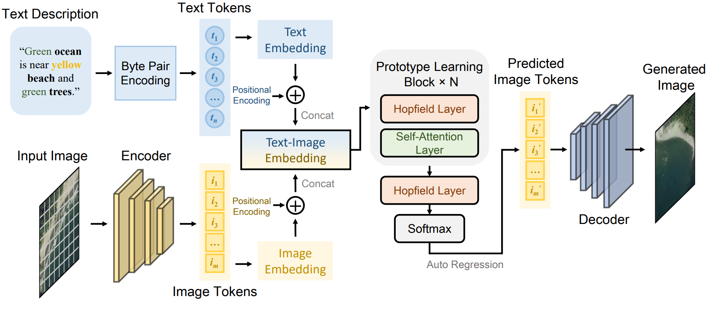
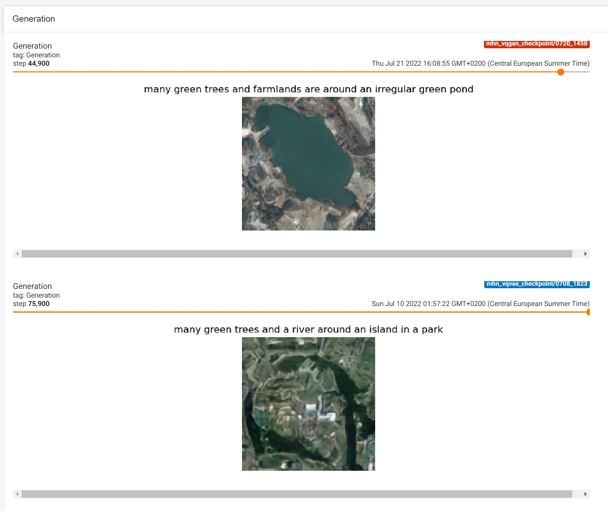
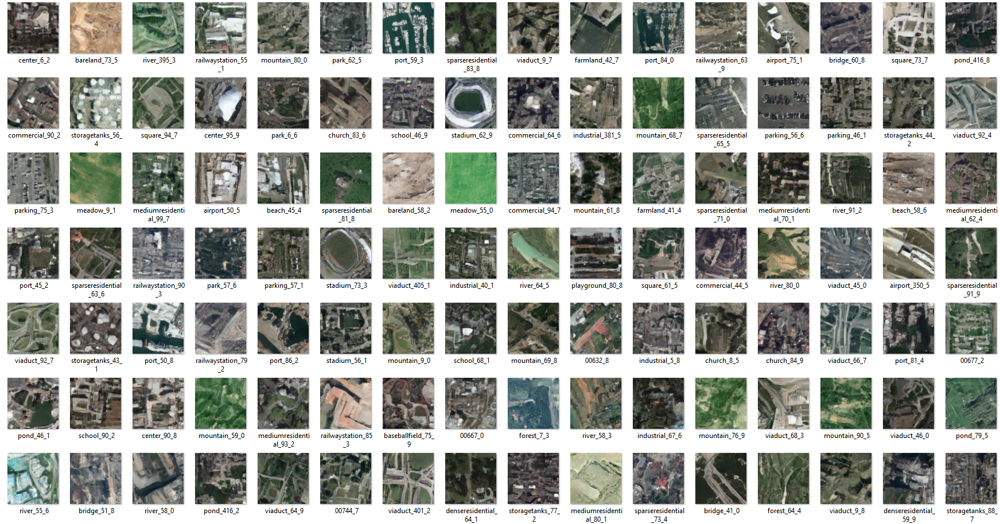

<h1 align="center">Txt2Img-MHN: Remote Sensing Image Generation from Text Using Modern Hopfield Networks</h1>

<h3 align="center"> <a href="https://yonghaoxu.github.io">Yonghao Xu</a>, <a href="https://scholar.google.com/citations?user=MjsztHYAAAAJ&hl=en">Weikang Yu</a>, <a href="https://www.ai4rs.com">Pedram Ghamisi</a>, <a href="https://www.iarai.ac.at/people/michaelkopp">Michael Kopp</a>,  and <a href="https://www.iarai.ac.at/people/sepphochreiter">Sepp Hochreiter</a></h3>
<br


    
This is the official PyTorch implementation of the paper **[Txt2Img-MHN: Remote Sensing Image Generation from Text Using Modern Hopfield Networks](https://arxiv.org/abs/2208.04441)**.
    
### Table of content
 1. [Preparation](#preparation)
 2. [Training VQVAE and VQGAN](#vae)
 3. [Training Txt2Img-MHN](#mhn)
 4. [Image Generation](#gen)
 5. [Inception Score and FID Score](#is)
 6. [Clip Score](#clip)
 7. [Zero-Shot Classification](#cls)
 8. [Paper](#paper)
 9. [Acknowledgement](#acknowledgement)
 10. [License](#license)

### Preparation
- Install required packages: `pip install -r requirements.txt`
- Install [Taming Transformers](https://github.com/CompVis/taming-transformers): 
  - Download the [repo](https://github.com/CompVis/taming-transformers)
  - Run `pip install -e .`
  - Copy the files in the folder `taming-transformers-master` from this repo to the downloaded `taming-transformers-master` folder
- Download the remote sensing text-image dataset [RSICD](https://github.com/201528014227051/RSICD_optimal) used in this repo
- Extract separate `.txt` files for the text descriptions of each image in RSICD: `python data_preparation.py`
- Data folder structure:
```
├── RSICD/
│   ├── airport_1.jpg   
│   ├── airport_2.jpg  
│   ├── ...  
│   ├── viaduct_420.jpg  
│   ├── airport_1.txt   
│   ├── airport_2.txt   
│   ├── ...  
│   ├── viaduct_420.txt   
```

### Training VQVAE and VQGAN <a name="vae"></a>
- Train VQVAE:
```
$ cd Txt2Img-MHN-main
$ CUDA_VISIBLE_DEVICES=0 python train_vqvae.py --data_dir /Path/To/RSICD/
```
- Train VQGAN:
```
$ cd taming-transformers-master
$ CUDA_VISIBLE_DEVICES=0 python main.py --base configs/custom_vqgan.yaml -t True --gpus 0,
```

### Training Txt2Img-MHN <a name="mhn"></a>
- Train Txt2Img-MHN with the pretrained VQVAE:
```
$ cd Txt2Img-MHN-main
$ CUDA_VISIBLE_DEVICES=0 python train_txt2img_mhn.py --vae_type 0 --data_dir /Path/To/RSICD/ --vqvae_path /Path/To/vae.pth --batch_size 8
```
- Train Txt2Img-MHN with the pretrained VQGAN:
```
$ cd Txt2Img-MHN-main
$ CUDA_VISIBLE_DEVICES=0 python train_txt2img_mhn.py --vae_type 1 --data_dir /Path/To/RSICD/ --vqgan_model_path /Path/To/last.ckpt --vqgan_config_path /Path/To/project.yaml --batch_size 8
```
Note: Training with multiple GPUs is supported. Simply specify the GPU ids with `CUDA_VISIBLE_DEVICES=0,1,2,3,4,5,6,7,...`
- Use tensorboard to monitor the training process:
```
$ cd Txt2Img-MHN-main
$ tensorboard --logdir ./ --samples_per_plugin images=100
```


### Image Generation <a name="gen"></a>
- Txt2Img-MHN (VQVAE):
```
$ cd Txt2Img-MHN-main
$ CUDA_VISIBLE_DEVICES=0 python gen_im.py --vae_type 0 --data_dir /Path/To/RSICD/ --vqvae_path /Path/To/vae.pth --mhn_vqvae_path /Path/To/mhn_vqvae.pth --num_gen_per_image 10
```
- Txt2Img-MHN (VQGAN):
```
$ cd Txt2Img-MHN-main
$ CUDA_VISIBLE_DEVICES=0 python gen_im.py --vae_type 1 --data_dir /Path/To/RSICD/ --vqgan_model_path /Path/To/last.ckpt --vqgan_config_path /Path/To/project.yaml  --mhn_vqgan_path /Path/To/mhn_vqgan.pth --num_gen_per_image 10
```
Alternatively, you can download our pretrained models for a quick look.
  - Txt2Img-MHN (VQVAE): [Google Drive](https://drive.google.com/file/d/1tCy2_30L4P5aVXo84JfjYd7-SBi_IRug/view?usp=sharing) &nbsp;&nbsp;&nbsp;&nbsp;&nbsp;&nbsp; [Baidu NetDisk](https://pan.baidu.com/s/1x-paMuVTSL1E4vHva26LUw) (Code: u14r)
  - Txt2Img-MHN (VQGAN): [Google Drive](https://drive.google.com/file/d/1oCkk2LXL0LhIo4HJSDIRK4PivcJjShXf/view?usp=sharing) &nbsp;&nbsp;&nbsp;&nbsp;&nbsp;&nbsp; [Baidu NetDisk](https://pan.baidu.com/s/1iQdCqM47GTT6cCoT-OGMKA) (Code: pt68)



### Inception Score and FID Score <a name="is"></a>
- Data preparation: Before training the Inception model, prepare a new data folder with the structure below: 
```
├── RSICD_cls/
│   ├── airport/     
|   |   ├── airport_1.jpg   
|   |   ├── airport_2.jpg   
|   |   ├── ... 
│   ├── bareland/     
|   |   ├── bareland_1.jpg   
|   |   ├── bareland_2.jpg   
|   |   ├── ... 
│   ├── ...  
│   ├── viaduct/     
|   |   ├── viaduct_1.jpg   
|   |   ├── viaduct_2.jpg   
|   |   ├── ...   
```
- Pretrain the Inception model:
```
$ cd Txt2Img-MHN-main/is_fid_score
$ CUDA_VISIBLE_DEVICES=0 python pretrain_inception.py --root_dir /Path/To/RSICD_cls/
```
- Calculate the Inception score and FID score:
```
$ cd Txt2Img-MHN-main/is_fid_score
$ CUDA_VISIBLE_DEVICES=0 python is_fid_score.py --gen_dir /Path/To/GenImgFolder/ --data_dir /Path/To/RSICD/
```

### Clip Score <a name="clip"></a>
- Calculate the Clip score with the [CLIP model fine-tuned on the RSICD dataset](https://github.com/arampacha/CLIP-rsicd):
```
$ cd Txt2Img-MHN-main
$ CUDA_VISIBLE_DEVICES=0 python is_fid_score.py --gen_dir /Path/To/GenImgFolder/ --data_dir /Path/To/RSICD/
```

### Zero-Shot Classification <a name="cls"></a>
```
$ cd Txt2Img-MHN-main/zero_shot_classification
$ CUDA_VISIBLE_DEVICES=0 python zero_shot_evaluation.py --gen_dir /Path/To/GenImgFolder/ --root_dir /Path/To/RSICD/
```

### Paper
**[Txt2Img-MHN: Remote Sensing Image Generation from Text Using Modern Hopfield Networks](https://arxiv.org/abs/2208.04441)**

Please cite the following paper if you find it useful for your research:

```
@article{txt2img_mhn,
  title={Txt2Img-MHN: Remote Sensing Image Generation from Text Using Modern Hopfield Networks},
  author={Xu, Yonghao and Yu, Weikang and Ghamisi, Pedram and Kopp, Michael and Hochreiter, Sepp},
  journal={IEEE Trans. Image Process.}, 
  year={2023}
}
```

### Acknowledgement

[DALLE-pytorch](https://github.com/lucidrains/DALLE-pytorch)

[taming-transformers](https://github.com/CompVis/taming-transformers)

[metrics](https://github.com/lzhbrian/metrics)

[CLIP-rsicd](https://github.com/arampacha/CLIP-rsicd)

*This research has been conducted at the [Institute of Advanced Research in Artificial Intelligence (IARAI)](https://www.iarai.ac.at/).*

### License
This repo is distributed under [MIT License](https://github.com/YonghaoXu/Txt2Img-MHN/blob/main/LICENSE). The code can be used for academic purposes only.